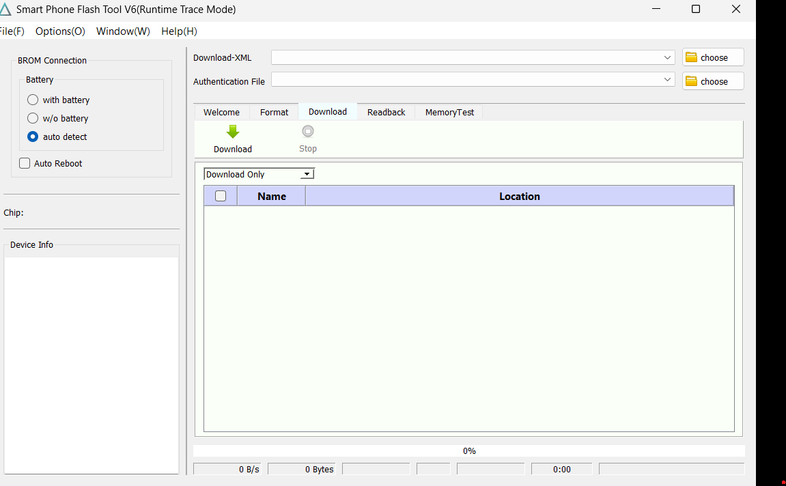
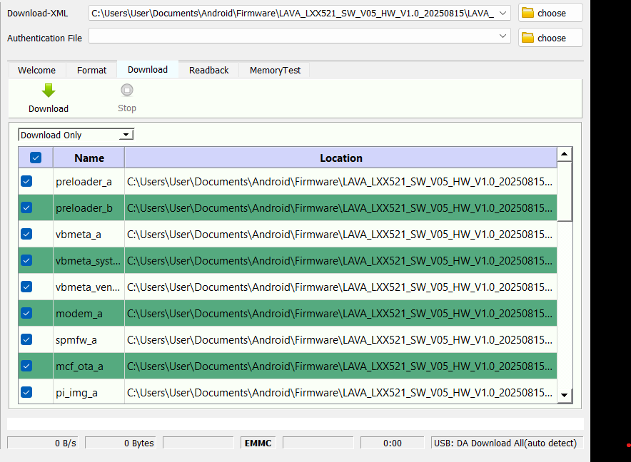
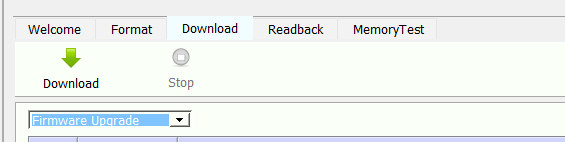

# 🛠️ Lava Play Ultra — Stock ROM Restore Guide

<div align="center">


</div>

> ⚠️ **Use this guide if your device is stuck in a bootloop, dm-verity corruption, or any other soft-brick state.**

---

## 📥 Step 1 — Download Required Files

| File | Download Link |
|------|--------------|
| SP Flash Tool | [spflashtools.com](https://spflashtools.com/category/windows) |
| MTK Driver | [mtkdriver.com](https://mtkdriver.com/mtk-driver-v5-2307/) |
| Device Firmware | [androidmtk.com](https://androidmtk.com/download-lava-stock-rom-firmware) → scroll down & search for **Lava Play Ultra 5G** |

---

## 📁 Step 2 — Prepare Your Folder

After downloading all three files, **extract them all into one single folder**:

```
📂 YourFolder
 ├── 📁 LAVA_LXX521_SW_V05_HW_V1.0_...   ← Firmware
 ├── 📁 SP_Flash_Tool_v6.2120_Win
 └── 📁 MTK-Driver-v5.2307
```


---

## 🔧 Step 3 — Install MTK Driver

1. Open the **MTK-Driver** folder
2. Click **MTK Driver Setup**
3. Follow the on-screen installation instructions

---

## ⚡ Step 4 — Configure SP Flash Tool

1. Open the **SP_Flash_Tool** folder and launch **SPFlashToolV6**



2. In the **Download-XML** section, click **Choose**
3. Navigate to your extracted firmware folder
4. Open the **`download_agent`** folder at the top and select the **`flash`** file
5. The partition list will populate automatically




---

## ⚠️ Step 5 — Select Firmware Upgrade Mode

> 🚨 **CRITICAL WARNING**: Only select **"Firmware Upgrade"** from the dropdown box.  
> **DO NOT** select `Format All + Download` — this will **permanently erase your device IMEI**!

Select: `Firmware Upgrade` ✅  
Never select: `Format All + Download` ❌


---

## 📲 Step 6 — Flash the Firmware

1. **Completely power off** your device
   - If your device is stuck in a reboot loop: hold the power button → release when the screen goes **off** → release before the display lights back on
2. Connect your device to PC via **original USB cable**
3. On successful detection, you will see `EMMC` change to `UFS` in SP Flash Tool, and device memory info will appear in the **Device Info** panel
4. Click the **"Download"** button



5. ⏳ Wait **20–25 minutes** — the progress bar will fill up. **Do NOT unplug the cable!**
6. A **"Completed & OK"** pop-up will appear when done

---

## ✅ Step 7 — Final Steps

1. Disconnect the USB cable from your PC
2. Power on your device
3. Go to **Settings → System Updates** and install all available OTA updates one by one
4. After all updates are done, **factory reset** your device
5. Your device is now fully restored and ready to use! 🎉

---

## 💬 Need Help?

Join our Telegram support channel:

[](https://t.me/lava_play_ultra)

---

<div align="center">

Made with ❤️ by the kotler-m2, for the community.

</div>
